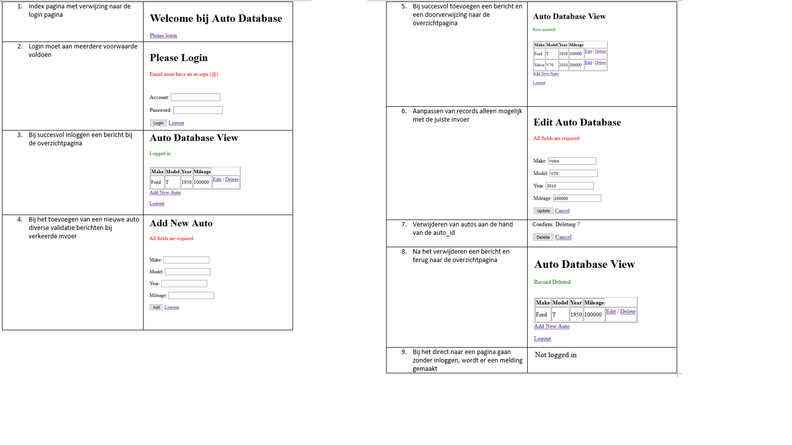

# php
### PHP oefeningen
Indeling: 
[Codecadamy](https://github.com/retuowmats/php/tree/master/Codecadamy) – voorbeelden van arrays en GET_POST handelingen  in een formulier. 
[Coursera](https://github.com/retuowmats/php/tree/master/coursera) - Mijn eerste C.R.U.D. assignment: 

